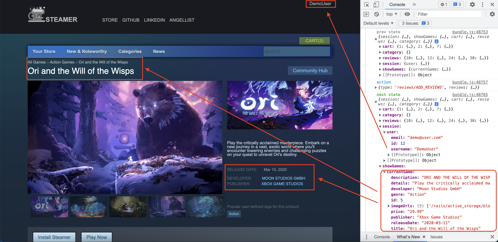
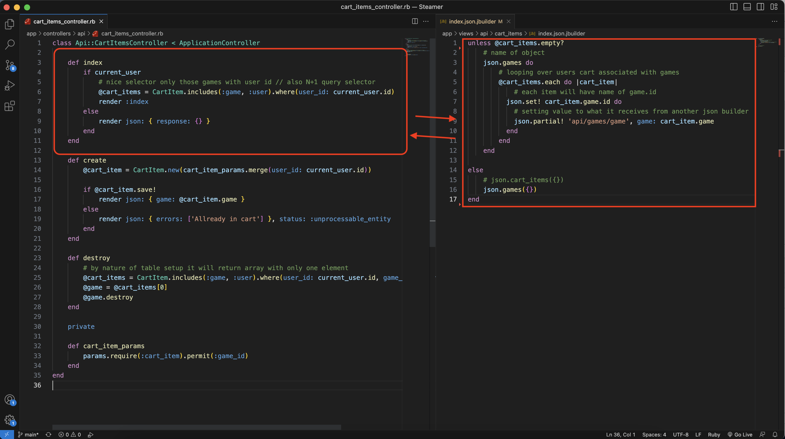
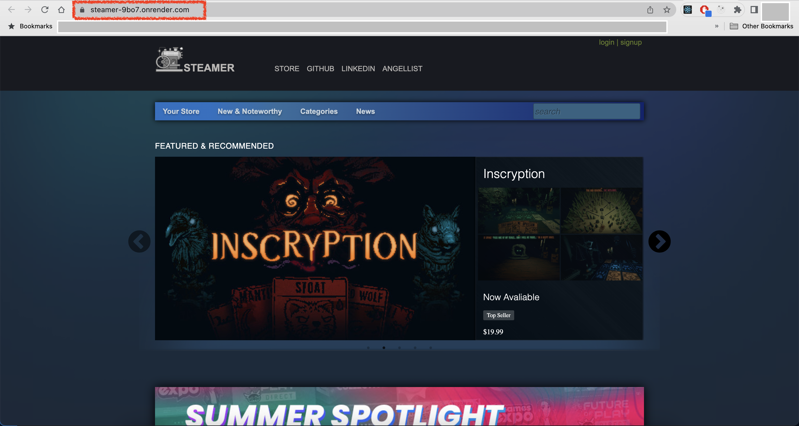

<h1 align="center">Steamer</h1>

&nbsp;&nbsp;&nbsp;&nbsp;[Steamer](https://steamer-9bo7.onrender.com/) - an exciting online game store clone project that brings the thrill of gaming right to your fingertips! Steamer is a user-friendly platform designed to replicate the immersive experience of browsing and purchasing games.

 With its sleek and modern interface, Steamer offers a vast collection of games from various genres. Whether you're a fan of action-packed adventures, mind-bending puzzles, or immersive role-playing epics, Steamer has got you covered.

    

<h1 align="center">Features</h1>

<h1 align="center">Technologies</h1>

## React and Redux

* In this project, I utilize React with Redux for efficient data handling on the front end and rendering interactive components.

## Ruby on Rails

* I rely on Ruby on Rails as my API backend to serve data from the database, which is powered by PostgreSQL. 

## Amazon Web Services

* For storing game and user images, I utilize the reliable cloud storage solution provided by AWS S3.

## CSS

* To ensure a visually appealing and polished user interface, I implement CSS for pixel-perfect site styling.

### Steam webpage

### Steamer webpage

## Render

* Finally, I deploy the application using Render.

